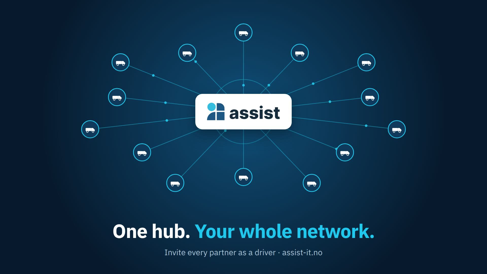

# Assist videos

Product videos for **[Assist](https://www.assist-it.no/en)** – dispatch and job management for roadside assistance and special transport.

## One hub. Your whole network. (46 sec)

Assist as a central dispatch hub: from the customer's QR scan to a completed and invoiced mission, in one platform.

▶ **[Watch the video](https://lrudlang-cloud.github.io/Assist-videos/)** · [Download MP4](videos/assist-dispatch-hub.mp4)

1. **Scan & share location** – the customer scans a QR code and sends a request with exact GPS.
2. **Instant alert** – your call centre is notified and accepts the request.
3. **Every partner on one map** – see the customer and all partners in your network.
4. **Dispatch in one click** – pick the closest start point and send the mission to the driver.
5. **Live on the road** – the driver accepts in the Assist app, and you follow the route live.
6. **Done & invoiced** – status, documentation and payment in the same mission.

---

Want to see Assist in action? **[Book a demo at assist-it.no](https://www.assist-it.no/en)**

© Assist IT AS
